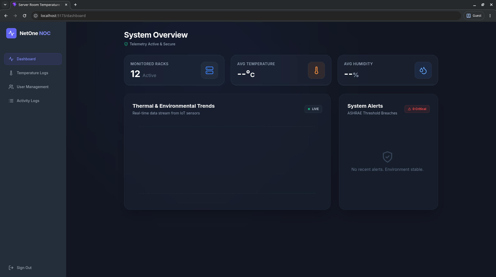

# Server Room Temperature Regulator

**A comprehensive, enterprise-grade temperature monitoring and control system designed for server rooms and critical environments.**



## Features

- **Real-time Monitoring**: Monitor temperature, humidity, and device power status in real-time with dynamic graphs.
- **User Management**: Secure login system with role-based access control (Admin & User roles).
- **Audit Trail**: Detailed logging of all system events, including temperature changes and user activities.
- **Device Management**: Add, edit, and remove temperature sensors and power distribution units.
- **Responsive Design**: Beautiful, modern UI that works seamlessly on desktop, tablet, and mobile devices.
- **Authentication Security**: Implements secure password hashing and session management.

## Getting Started

### System Requirements

- **Operating System**: This system is designed to run natively on **Linux**. 
  - *Windows Users*: You must set up **Windows Subsystem for Linux (WSL)** or use a virtual machine (e.g., VirtualBox) with a Linux distribution installed (like Ubuntu) to run this system properly.
- **Python 3.10+**
- **Node.js 16+** (for frontend development)

### Complete Setup Instructions

1. **Clone the repository**

   ```bash
   git clone https://github.com/patrick-zvenyka/server-room-temperature-regulator.git
   cd server-room-temperature-regulator
   ```

2. **Backend Setup (Automated via setup.sh)**

   We provide a convenient bash script (`setup.sh`) that automates the virtual environment activation, database migrations, superuser creation, and starts the Django development server.

   First, ensure your virtual environment is created:
   ```bash
   python3 -m venv venv
   ```

   Then, grant execution permissions and run the setup script:
   ```bash
   chmod +x setup.sh
   ./setup.sh
   ```

   *Note: The script automatically provisions a default admin account (`admin` / `adminpassword123`) if one doesn't exist, and leaves the backend running on `localhost:8000`.*

3. **Frontend Setup (React)**

   In a new terminal window, navigate to the frontend directory, install dependencies, and start the development server:

   ```bash
   cd frontend
   npm install
   npm run dev
   ```

   The application will be accessible at `http://localhost:5173`.

## Project Structure

```
server-room-temperature-regulator/
├── core/                  # Django Backend
│   ├── settings.py        # Project settings
│   ├── urls.py            # API routes
│   ├── views.py           # API logic
│   └── ...
├── frontend/              # React Frontend
│   ├── src/
│   │   ├── components/    # Reusable UI components
│   │   ├── pages/         # Page components (Dashboard, Login, etc.)
│   │   ├── context/       # React Context (Auth, etc.)
│   │   └── App.jsx        # Main application entry point
│   └── ...
├── assets/                # Images and static files
├── requirements.txt       # Backend dependencies
└── package.json           # Frontend dependencies
```

## License

[MIT License](LICENSE)